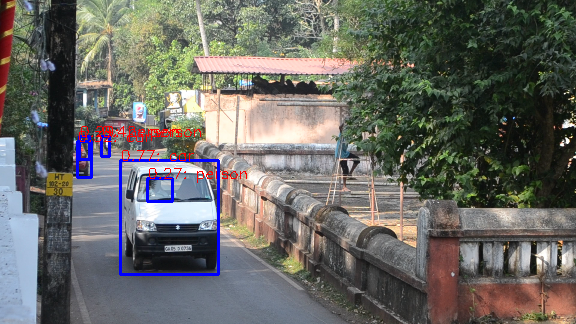

# Micro-service for Traffic Scenes
WORK IN PROGRESS

### Requirements:
- OpenCV3
- Tensorflow 1.0
- Darkflow https://github.com/thtrieu/darkflow

### Installation
**Install OpenCV3**
```
sudo apt-get install libopencv-dev python-opencv
```
**Install Tensorflow-1.0**
While the latest version is 1.4, I recommend installation of tensorflow-1.0.
Current code base in compatible with version 1.0. Cannot garuntee on 1.4.
See !(this)[https://www.tensorflow.org/install/install_linux] for installation.

**Install Darkflow**
Make sure you have already installed tensorflow before this step and are able
to run demo codes.
```
git clone https://github.com/thtrieu/darkflow
cd darkflow
sudo pip install .
```

Download learned models from : https://drive.google.com/drive/folders/0B1tW_VtY7onidEwyQ2FtQVplWEU
and keep them in './bin/'

### Demo
Currently there are 2 demos. Make sure those work. If those
don't work put issues in this git repo.



### Author
Manohar Kuse <mpkuse@connect.ust.hk>
